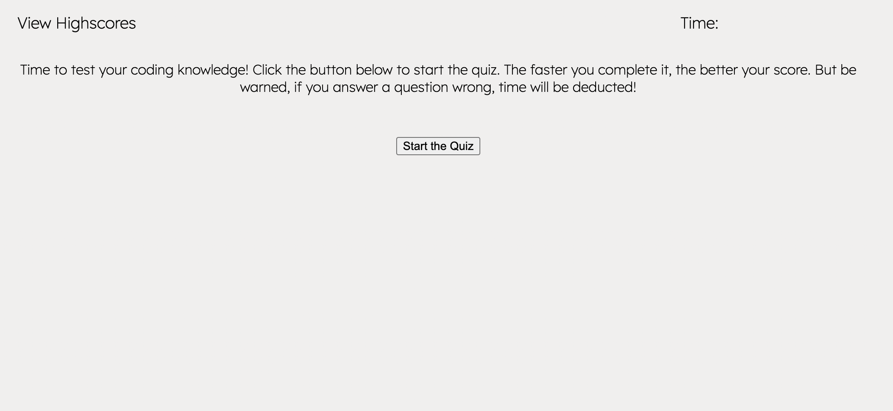
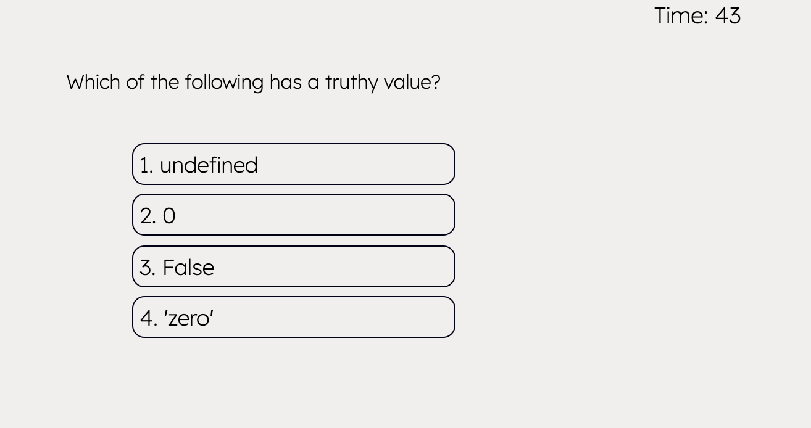
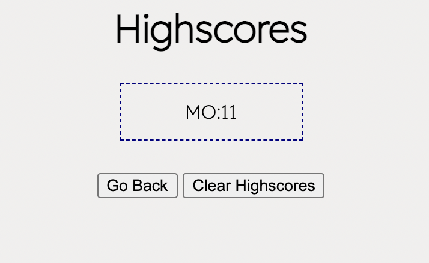

# timed-coding-challenge

Description:
This quiz puts your coding knowledge to the test! It contains multiple choice questions that must be answered qucikly and accurately or your score will be effected. See your scores on the highscore page and try to beat your personal best.

Technologies:
HTML
JavaScript
Local Storage to save highscores
Set Interval function for timer

URL: https://madsterest.github.io/timed-coding-challenge/

